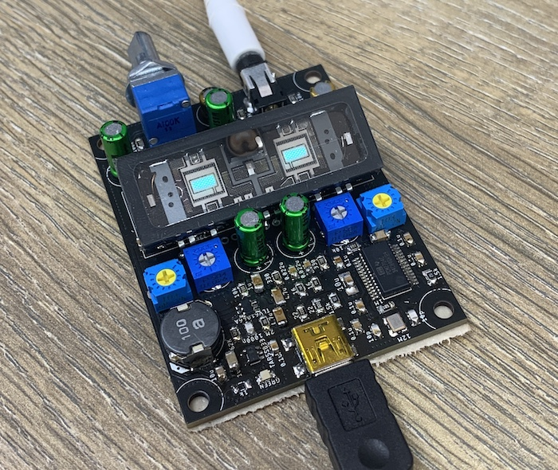

# Nutrino

**Nutrino** is a USB headphone amplifier featuring the application of the **Nutube**. It incorporates the PCM2704 as the codec IC and utilizes the NJM4580 for the operational amplifier in the output stage.

The circuit design was completed using Eagle. The schematic diagram is [here](misc/nutrino.pdf).